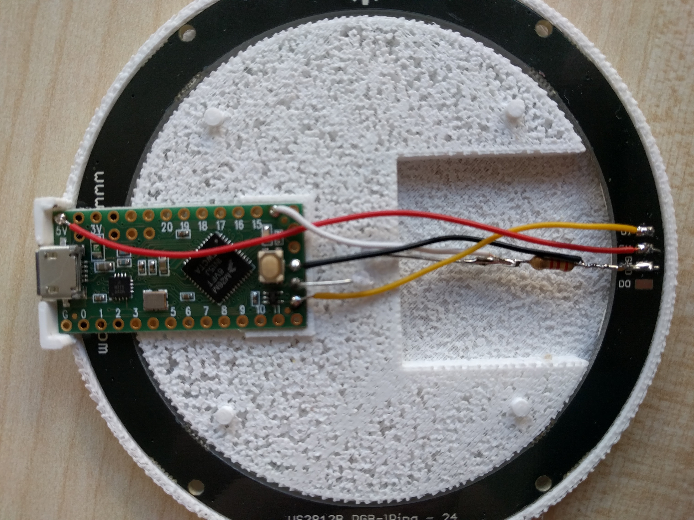

# Parts List
The components below can also be ordered in bulk directly from manufacturers at a steep discount. 

<table>
  <tr>
    <td>Name</td>
    <td>Purpose & Wiring</td>
    <td>Where to buy</td>
    <td>Cost</td>
  </tr>
  <tr>
    <td>Teensy-LC</td>
    <td>Low-Cost Microntroller with USB port and dedicated input voltage pin for driving NeoPixel Pins

VIN is used for the NeoPixel Power Supply, GND is used for NeoPixel and Sensor GND. </td>
    <td>http://www.watterott.com/de/Teensy-LC-USB-Development-Board</td>
    <td>~12 EUR</td>
  </tr>
  <tr>
    <td>24 Neopixel Ring</td>
    <td>Individually addressable RGB Pixel Ring, 5V power supply based. 
Directly connected to the PIN 17, which is at VIN Voltage.</td>
    <td>http://www.watterott.com/de/WS2812-RGB-Ring-24-Black-Edition</td>
    <td>~18 EUR</td>
  </tr>
  <tr>
    <td>LDR</td>
    <td>Low-Cost sensor for sensing light. Used to detect light changes and determine product on/off status. A voltage divider is built using the 2.2k resistor and input PIN 14 (A0) is used. </td>
    <td>http://www.ebay.de/itm/311275309525?_trksid=p2057872.m2749.l2649&ssPageName=STRK%3AMEBIDX%3AIT</td>
    <td>a few cents per item</td>
  </tr>
  <tr>
    <td>2.2k resistor</td>
    <td>Low cost electric component</td>
    <td></td>
    <td>almost nothing</td>
  </tr>
  <tr>
    <td>USB hubs</td>
    <td>Recommended as there are issues with other hubs</td>
    <td>https://www.amazon.de/gp/product/B00E0NHMNQ/ref=oh_aui_search_detailpage?ie=UTF8&psc=1</td>
    <td>Spend the money for exactly these as you are in big trouble otherwise.</td>
  </tr>
  <tr>
    <td>USB cables</td>
    <td>Recommended as they are good quality, sometimes there are issues with low quality cables</td>
    <td>https://www.amazon.de/gp/product/B00TALGDMO/ref=oh_aui_search_detailpage?ie=UTF8&psc=1</td>
    <td>Spend the money for exactly these cables!</td>
  </tr>
</table>

#Platform Assembly
Once you have ordered all the parts and also 3D-printed a platform element, you can solder the parts as pictured below:

